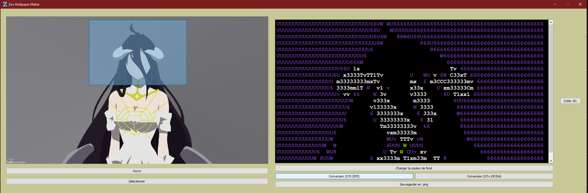

<p align="center">
  <a href="" rel="noopener">
 </a>
</p>

<h3 align="center">Editeur de Fond d'écran sous ZOS</h3>

<div align="center">

[]()
[](https://github.com/Emericdefay/zos-wallpaper-maker/issues)
[](https://github.com/Emericdefay/zos-wallpaper-maker/pulls)
[](/LICENSE)

</div>

---

<p align="center"> Petit éditeur pour générer son propre fond d'écrans sur ZOS
    <br> 
</p>


# Zos WallPaper Maker
Ce programme permet de générer des images ASCII à partir d'images réelles et de générer un script JCL associé pour l'appliquer à ZOS.

<p align="center">
  
</p>
<details>
  <summary>Concernant le code</summary>

  ## Prérequis
  Pour pouvoir utiliser ce programme, vous devez avoir installé les bibliothèques suivantes :

  - Python 3.6 ou supérieur
  - PyQt5
  - Pillow

  Vous pouvez les installer en utilisant pip :

  ```
  pip install -r requirements.txt
  ```

  ## Execution 

  Pour lancer le programme, exécutez le fichier main.py à l'aide de Python :

  ```
  python main.py
  ```

  Vous devriez alors voir s'ouvrir une fenêtre avec l'interface du programme. Suivez les instructions à l'écran pour utiliser le programme.

  ## Note

  Ce programme a été testé sur Windows 10 et Linux (Ubuntu 20.04). Si vous rencontrez des problèmes sur d'autres plateformes, n'hésitez pas à ouvrir une issue sur ce dépôt pour nous en informer.
</details>
<details>
  <summary>Concernant le programme Release</summary>

  # Tutoriel

  1. Ouvrez votre image
  2. Selectionnez la zone de l'image que vous voulez cibler
     1. Vous pouvez cliquer sur l'image pour cibler une zone
     2. Vous pouvez également déplacer cette zone
  3. Cliquez sur ```Selectionner``` pour convertir votre image en ASCII
  4. Vous pouvez choisir le fond qui vous convient, par défaut c'est en noir, comme sur ZOS
  5. Choisissez le protocol de convertion *adapté à votre système*, pour ZOS R1.10, il s'agit de SFE.
  6. Cliquez sur ```Créer le JCL``` et choisissez un endroit où enregistrer le script JCL
  7. Importez ce JCL sur votre système ZOS
  8. Executez le JCL
  9. Redémarrez votre système pour appliquer le changement


</details>